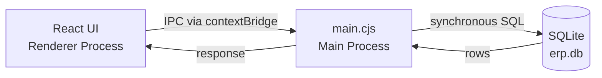

# AGS ERP Desktop – Offline Inventory & Accounting Suite

A lightweight, offline-first ERP application built with **Electron**, **React** and **SQLite**. Manage products, invoices, orders and ledgers — no internet or monthly fees required.

> 100 % local. Your data never leaves your machine.

---

## ✨ Features

| Module | Highlights |
|--------|-----------|
| **Product Master** | Maintain products with code, size, packing type, cost & selling price. Soft-delete with scheduled cleanup. |
| **GST-ready Invoices** | Create, edit, print invoices. Auto-incremental IDs (`E-1`, `E-2`…) with number reuse on deletion. |
| **Customer & Supplier Accounts** | Full Maal (sales/purchases) and Jama (payments) ledgers with running balances. |
| **Linked Entry Protection** | Invoice/order-linked ledger entries are guarded — edit and delete blocked with clear feedback. |
| **Sales & Purchase Orders** | Draft and manage orders for customers and suppliers. Track order status (Placed → Received). |
| **Price List** | Standard rate card management with inline editing. |
| **Search & Filters** | Instant search across all masters, date-range filtering on accounts. |
| **Print Friendly** | Crisp, formatted invoice printing via `react-to-print`. |

---

## 🏗 Tech Stack

| Layer | Technology |
|-------|-----------|
| **UI** | React 19 · Vite 6 · Tailwind CSS 4 · React Router 7 · Lucide React · Framer Motion |
| **Desktop Shell** | Electron 37 · IPC (context-isolated, no `nodeIntegration`) |
| **Database** | SQLite 3 via better-sqlite3 (synchronous, single-file) |
| **Packaging** | electron-builder (NSIS for Windows, DMG for macOS) |

---

## 📂 Project Structure

```
ags-erp-desktop/
├── main.cjs              # Electron main process — window, IPC, DB init
├── preload.js            # Context bridge (exposes window.api)
├── db.js                 # SQLite schema, migrations, table creation
├── ipcHandlers.js        # All IPC handlers (CRUD for every module)
├── erpApi.js             # Shared API helpers
├── icons/
│   ├── icon.ico          # Windows icon
│   └── icon.png          # macOS icon
├── src/                  # React application
│   ├── modules/
│   │   ├── accounts/     # Customer & Supplier account detail + entry forms
│   │   ├── invoice/      # Invoice creation, editing, printing
│   │   ├── orders/       # Customer & Supplier order management
│   │   └── priceList/    # Product price list
│   ├── utils/            # Shared utilities (sorting, formatting)
│   ├── App.jsx
│   └── main.jsx
├── package.json          # Scripts, deps, electron-builder config
├── vite.config.mjs       # Vite build config
└── release/              # Built installers (.exe / .dmg)
```

---

## 🔧 Architecture



- **Renderer** calls `window.api.invoke(channel, ...args)` — fully context-isolated.
- **Main process** routes IPC to handlers in `ipcHandlers.js`, which run synchronous SQL via `better-sqlite3`.
- **Database** lives in the OS user-data directory (`app.getPath('userData')/erp.db`), ensuring write access and per-user isolation. Never bundled inside the app asar.

---

## 🚀 Getting Started

### Prerequisites

- **Node.js ≥ 20** — [download](https://nodejs.org/)
- **Git**
- **Native build tools** (required by `better-sqlite3`):
  - **Windows:** Visual Studio Build Tools + Python
  - **macOS:** Xcode Command Line Tools (`xcode-select --install`)

### Clone & Install

```bash
git clone https://github.com/agrawalvansh/ags-erp-desktop.git
cd ags-erp-desktop
npm install
```

### Run in Development

```bash
npm run dev
```

This builds the React UI with Vite, then launches Electron. The SQLite database is created automatically on first run with all tables and migrations.

### Build Installer

```bash
# Windows (.exe installer)
npm run build
# or explicitly:
npm run build:win

# macOS (.dmg) — must be run on a Mac
npm run build:mac
```

The installer will be output to the `release/` directory.

---

## 🗄 Database Schema

All tables are auto-created on first boot from `db.js`. No manual migration needed.

```
products                 customers                 suppliers
┌─ code (PK) ──────┐    ┌─ customer_id (PK) ──┐    ┌─ supplier_id (PK) ──┐
│  name             │    │  name               │    │  name               │
│  size             │    │  address             │    │  address             │
│  cost_price       │    │  mobile              │    │  mobile              │
│  selling_price    │    └─────────────────────┘    └──────────────────────┘
│  packing_type     │
│  is_deleted       │
└───────────────────┘

invoices                 invoice_items
┌─ invoice_id (PK) ┐    ┌─ id (PK) ────────────┐
│  customer_id (FK) │◄───│  invoice_id (FK)     │
│  invoice_date     │    │  product_code (FK)   │
│  grand_total      │    │  quantity            │
│  packing/freight  │    │  selling_price       │
└───────────────────┘    └──────────────────────┘

customer_maal_account    customer_jama_account
┌─ id (PK) ────────┐    ┌─ id (PK) ────────────┐
│  customer_id (FK) │    │  customer_id (FK)    │
│  maal_date        │    │  jama_date           │
│  maal_invoice_no  │    │  jama_txn_type       │
│  maal_amount      │    │  jama_amount         │
│  maal_remark      │    │  jama_remark         │
└───────────────────┘    └──────────────────────┘

customer_orders / supplier_orders  (+ _order_items)
supplier_maal_account / supplier_jama_account
document_sequences / reusable_invoice_numbers / migration_history
```

---

## � IPC Channels (excerpt)

All communication uses Electron IPC. There is no REST API.

| Channel | Description |
|---------|------------|
| `products:getAll` | List all products (excluding soft-deleted) |
| `products:create` | Add a new product |
| `invoices:create` | Create invoice with line items + auto Maal entry |
| `invoices:getNextId` | Get next available invoice number (with reuse pool) |
| `customers:maalGet` | Fetch a single Maal entry for editing |
| `customers:maalUpdate` | Update a standalone Maal entry |
| `customers:txnCreate` | Record a customer Jama payment |
| `customers:txnDelete` | Delete Jama entry (blocked if linked to invoice/order) |
| `supOrders:create` | Create supplier order with items + Jama entry |
| `admin:cleanupSoftDeletedProducts` | Permanently remove soft-deleted products |

> See `ipcHandlers.js` for the complete list of ~50 channels.

---

## � Linked Entry Protection

Entries auto-created by invoices or orders are protected:

- **Maal entries** linked to an invoice → cannot be deleted; clicking edit redirects to the invoice page.
- **Jama entries** with remarks starting with `Invoice ` or `Order ` → backend guards block deletion with a descriptive error toast.
- **Standalone entries** (manually created) → fully editable and deletable.

---

## 📋 NPM Scripts

| Script | Purpose |
|--------|---------|
| `npm run dev` | Build React + launch Electron |
| `npm run build` | Build React + package installer (auto-detects OS) |
| `npm run build:win` | Build Windows `.exe` installer |
| `npm run build:mac` | Build macOS `.dmg` (run on Mac only) |
| `npm run build-react` | Vite production build only |
| `npm run start` | Launch Electron (assumes `dist/` exists) |

---

## 💽 Packaging Notes

- **Database path** — Uses `app.getPath('userData')` for writable, per-user storage. Never writes to the app bundle.
- **better-sqlite3** — Listed in `dependencies` (not `devDependencies`). Native bindings are rebuilt automatically via the `postinstall` script.
- **Icons** — Windows uses `icons/icon.ico`, macOS uses `icons/icon.png`.
- **Extra resources** — `erp.db` seed file bundled as an extra resource for first-run seeding.

---

## 🤝 Contributing

1. Fork the repo and create a feature branch.
2. Commit with conventional messages.
3. Open a Pull Request — improvements welcome!

---

## 📝 License

Released under the **MIT License**. See `LICENSE` for details.

---

> Crafted with ❤️ by **Vansh Agrawal**
