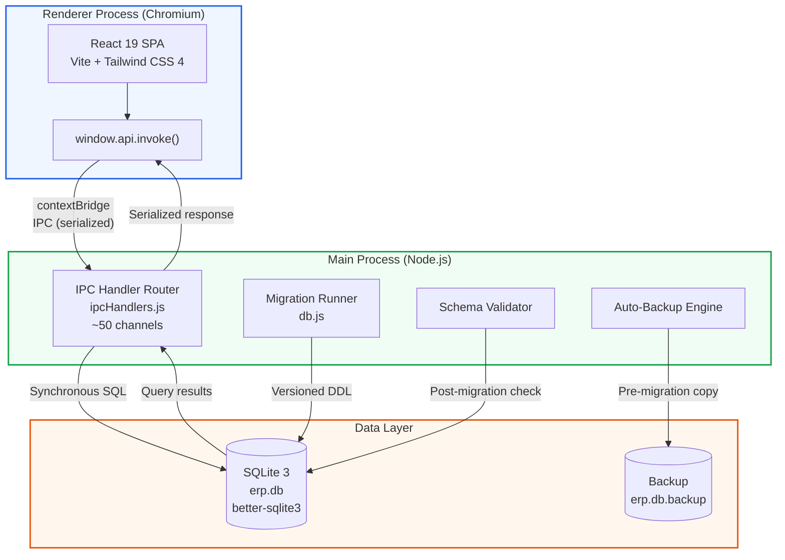
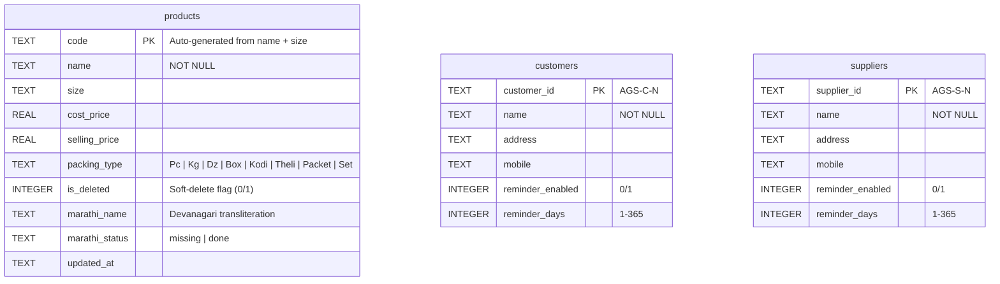
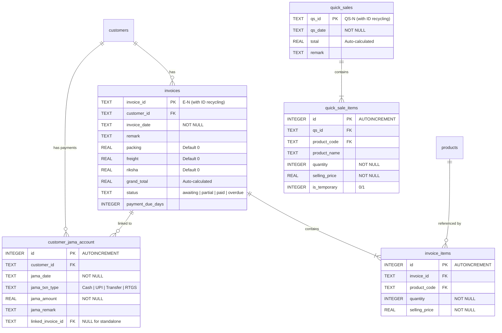
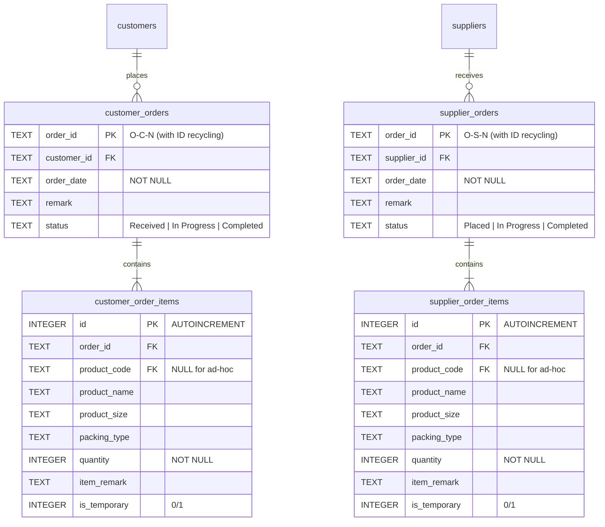
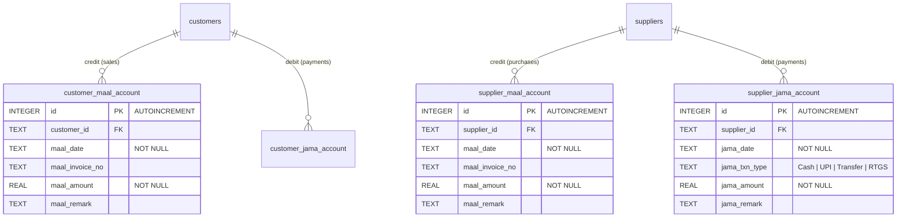
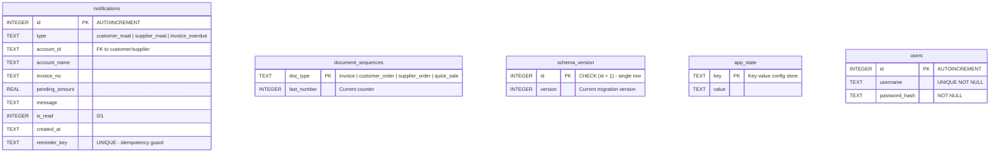
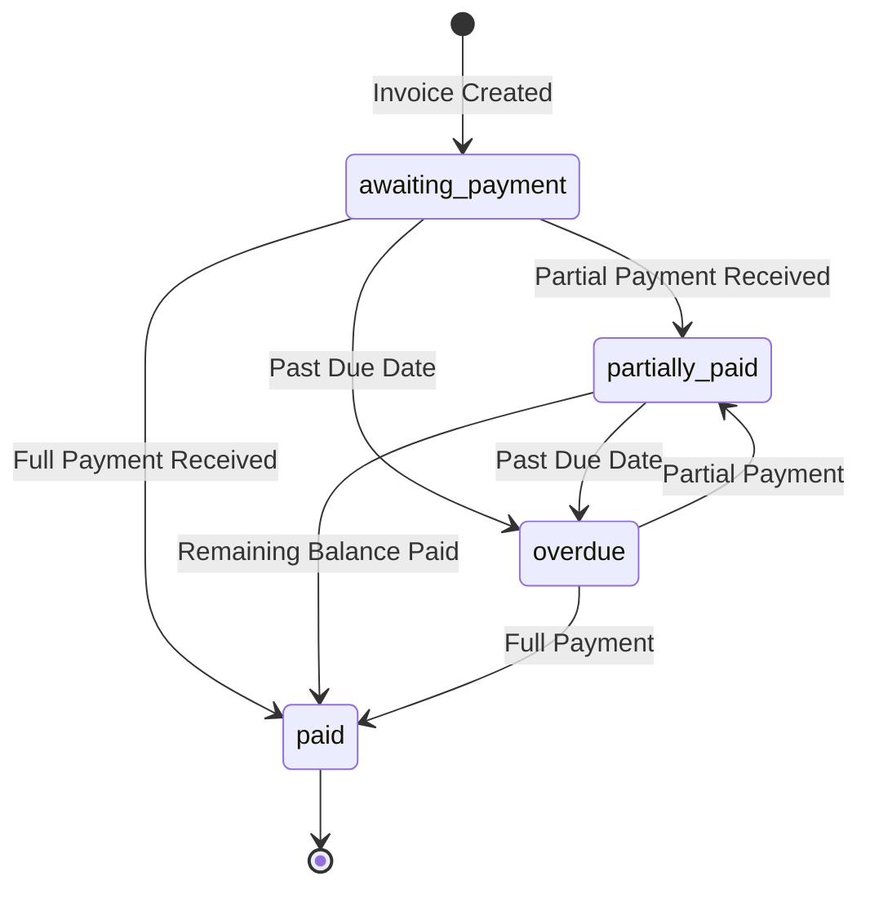
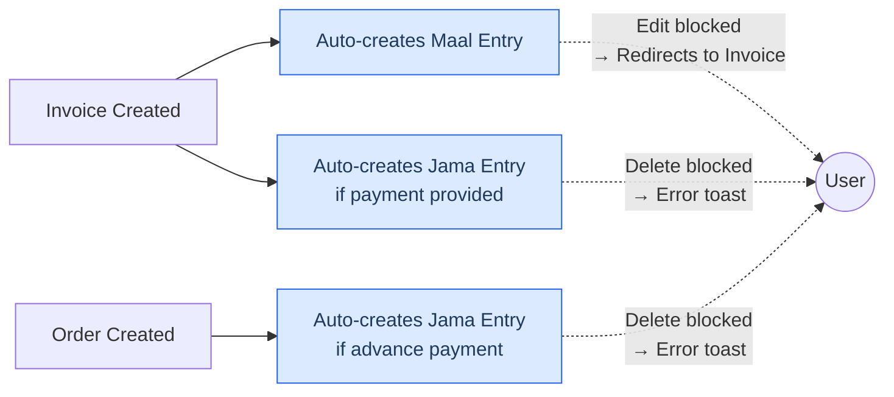
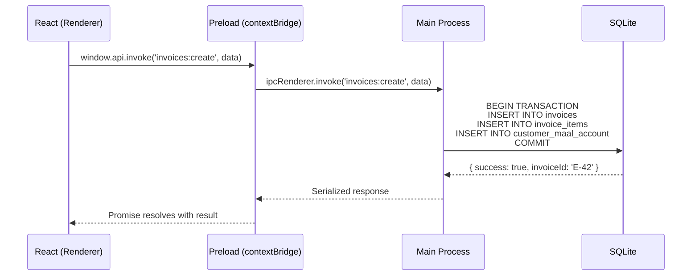
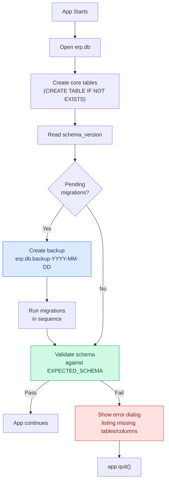

<div align="center">

# AGS ERP Desktop

**Offline-First Inventory, Invoicing & Accounting Suite**

[](https://www.electronjs.org/)
[](https://react.dev/)
[](https://www.sqlite.org/)
[](https://vitejs.dev/)
[](https://tailwindcss.com/)
[](LICENSE)
[](package.json)

A production-grade, cross-platform desktop ERP application built for a real-world retail business. Manages **products, GST-ready invoices, customer/supplier accounts, purchase & sales orders, and double-entry ledgers**   all running 100% offline with zero recurring costs.

> 🔒 **100% Local. Your data never leaves your machine.**

[Features](#-features) · [Architecture](#-architecture) · [Database Schema](#-database-schema) · [Getting Started](#-getting-started) · [Tech Stack](#-tech-stack) · [Documentation](#-documentation)

</div>

---

## At a Glance

| Module | What it does |
|--------|-------------|
| **Invoice Engine** | GST-ready invoices with auto-ID generation, ID recycling, multi-payment tracking, overdue detection, and payment status lifecycle management |
| **Product Catalog** | Full CRUD with soft-delete, code auto-generation, cost-price visibility toggle, Marathi transliteration, and catalog PDF export |
| **Quick Sales (POS)** | Lightweight point-of-sale flow for ad-hoc transactions without customer assignment |
| **Customer & Supplier Accounts** | Double-entry Maal (credit) / Jama (debit) ledgers with running balances, linked entry protection, and PDF statements |
| **Order Management** | Customer & supplier orders with status tracking (Placed → In Progress → Completed), advance payments, and order-to-ledger linking |
| **Notification System** | Automated payment reminders, overdue invoice alerts, desktop notifications, and an in-app notification center with unread badge |
| **Marathi Translation** | AI-powered transliteration of product names to Devanagari script via Google Input Tools API |
| **Print & PDF** | System printer selection, print-optimized layouts, and PDF generation for invoices, orders, ledgers, and the product catalog |

---

## Architecture

The application follows Electron's **security-first** architecture with complete **context isolation**   the renderer process has zero direct access to Node.js APIs or the filesystem.


```mermaid
graph TB
    subgraph Renderer ["Renderer Process (Chromium)"]
        UI["React 19 SPA<br/>Vite + Tailwind CSS 4"]
        CB["window.api.invoke()"]
        UI --> CB
    end

    subgraph Main ["Main Process (Node.js)"]
        IPC["IPC Handler Router<br/>ipcHandlers.js<br/>~50 channels"]
        MIG["Migration Runner<br/>db.js"]
        VAL["Schema Validator"]
        BKP["Auto-Backup Engine"]
    end

    subgraph Data ["Data Layer"]
        DB[("SQLite 3<br/>erp.db<br/>better-sqlite3")]
        BAK[("Backup<br/>erp.db.backup")]
    end

    CB -- "contextBridge<br/>IPC (serialized)" --> IPC
    IPC -- "Synchronous SQL" --> DB
    MIG -- "Versioned DDL" --> DB
    VAL -- "Post-migration check" --> DB
    BKP -- "Pre-migration copy" --> BAK
    DB -- "Query results" --> IPC
    IPC -- "Serialized response" --> CB

    style Renderer fill:#EFF6FF,stroke:#2563EB,stroke-width:2px
    style Main fill:#F0FDF4,stroke:#16A34A,stroke-width:2px
    style Data fill:#FFF7ED,stroke:#EA580C,stroke-width:2px
```

### Key Architecture Decisions

| Decision | Rationale |
|----------|-----------|
| **Context Isolation + Preload Bridge** | Security best practice   renderer cannot access `require()`, `fs`, or any Node.js API directly. All communication goes through a whitelisted `contextBridge` API. |
| **Synchronous SQL (better-sqlite3)** | 3–5× faster than async alternatives for single-user desktop apps. No connection pool overhead. Transactions are atomic by default. |
| **Single-file Database** | The entire application state lives in one `erp.db` file in `%APPDATA%`. Easy to back up, migrate, and restore. |
| **Versioned Migrations** | NSIS installer overwrites app code but preserves `%APPDATA%` data. The migration system ensures schema compatibility across upgrades. |
| **Route-Level Code Splitting** | `React.lazy()` with `Suspense` reduces initial bundle size. Each module loads on-demand. |

---

## Database Schema

20 tables organized into 6 domains. The schema is auto-created on first boot and maintained by a versioned migration system with post-migration validation.

### Core Business Entities


```mermaid
erDiagram
    products {
        TEXT code PK "Auto-generated from name + size"
        TEXT name "NOT NULL"
        TEXT size
        REAL cost_price
        REAL selling_price
        TEXT packing_type "Pc | Kg | Dz | Box | Kodi | Theli | Packet | Set"
        INTEGER is_deleted "Soft-delete flag (0/1)"
        TEXT marathi_name "Devanagari transliteration"
        TEXT marathi_status "missing | done"
        TEXT updated_at
    }

    customers {
        TEXT customer_id PK "AGS-C-N"
        TEXT name "NOT NULL"
        TEXT address
        TEXT mobile
        INTEGER reminder_enabled "0/1"
        INTEGER reminder_days "1-365"
    }

    suppliers {
        TEXT supplier_id PK "AGS-S-N"
        TEXT name "NOT NULL"
        TEXT address
        TEXT mobile
        INTEGER reminder_enabled "0/1"
        INTEGER reminder_days "1-365"
    }
```

### Invoicing & Sales


```mermaid
erDiagram
    customers ||--o{ invoices : "has"
    invoices ||--|{ invoice_items : "contains"
    products ||--o{ invoice_items : "referenced by"
    customers ||--o{ customer_jama_account : "has payments"
    invoices ||--o{ customer_jama_account : "linked to"

    invoices {
        TEXT invoice_id PK "E-N (with ID recycling)"
        TEXT customer_id FK
        TEXT invoice_date "NOT NULL"
        TEXT remark
        REAL packing "Default 0"
        REAL freight "Default 0"
        REAL riksha "Default 0"
        REAL grand_total "Auto-calculated"
        TEXT status "awaiting | partial | paid | overdue"
        INTEGER payment_due_days
    }

    invoice_items {
        INTEGER id PK "AUTOINCREMENT"
        TEXT invoice_id FK
        TEXT product_code FK
        INTEGER quantity "NOT NULL"
        REAL selling_price "NOT NULL"
    }

    customer_jama_account {
        INTEGER id PK "AUTOINCREMENT"
        TEXT customer_id FK
        TEXT jama_date "NOT NULL"
        TEXT jama_txn_type "Cash | UPI | Transfer | RTGS"
        REAL jama_amount "NOT NULL"
        TEXT jama_remark
        TEXT linked_invoice_id FK "NULL for standalone"
    }

    quick_sales {
        TEXT qs_id PK "QS-N (with ID recycling)"
        TEXT qs_date "NOT NULL"
        REAL total "Auto-calculated"
        TEXT remark
    }

    quick_sales ||--|{ quick_sale_items : "contains"

    quick_sale_items {
        INTEGER id PK "AUTOINCREMENT"
        TEXT qs_id FK
        TEXT product_code FK
        TEXT product_name
        INTEGER quantity "NOT NULL"
        REAL selling_price "NOT NULL"
        INTEGER is_temporary "0/1"
    }
```

### Order Management


```mermaid
erDiagram
    customers ||--o{ customer_orders : "places"
    customer_orders ||--|{ customer_order_items : "contains"
    suppliers ||--o{ supplier_orders : "receives"
    supplier_orders ||--|{ supplier_order_items : "contains"

    customer_orders {
        TEXT order_id PK "O-C-N (with ID recycling)"
        TEXT customer_id FK
        TEXT order_date "NOT NULL"
        TEXT remark
        TEXT status "Received | In Progress | Completed"
    }

    customer_order_items {
        INTEGER id PK "AUTOINCREMENT"
        TEXT order_id FK
        TEXT product_code FK "NULL for ad-hoc"
        TEXT product_name
        TEXT product_size
        TEXT packing_type
        INTEGER quantity "NOT NULL"
        TEXT item_remark
        INTEGER is_temporary "0/1"
    }

    supplier_orders {
        TEXT order_id PK "O-S-N (with ID recycling)"
        TEXT supplier_id FK
        TEXT order_date "NOT NULL"
        TEXT remark
        TEXT status "Placed | In Progress | Completed"
    }

    supplier_order_items {
        INTEGER id PK "AUTOINCREMENT"
        TEXT order_id FK
        TEXT product_code FK "NULL for ad-hoc"
        TEXT product_name
        TEXT product_size
        TEXT packing_type
        INTEGER quantity "NOT NULL"
        TEXT item_remark
        INTEGER is_temporary "0/1"
    }
```

### Account Ledgers (Double-Entry)


```mermaid
erDiagram
    customers ||--o{ customer_maal_account : "credit (sales)"
    customers ||--o{ customer_jama_account : "debit (payments)"
    suppliers ||--o{ supplier_maal_account : "credit (purchases)"
    suppliers ||--o{ supplier_jama_account : "debit (payments)"

    customer_maal_account {
        INTEGER id PK "AUTOINCREMENT"
        TEXT customer_id FK
        TEXT maal_date "NOT NULL"
        TEXT maal_invoice_no
        REAL maal_amount "NOT NULL"
        TEXT maal_remark
    }

    supplier_maal_account {
        INTEGER id PK "AUTOINCREMENT"
        TEXT supplier_id FK
        TEXT maal_date "NOT NULL"
        TEXT maal_invoice_no
        REAL maal_amount "NOT NULL"
        TEXT maal_remark
    }

    supplier_jama_account {
        INTEGER id PK "AUTOINCREMENT"
        TEXT supplier_id FK
        TEXT jama_date "NOT NULL"
        TEXT jama_txn_type "Cash | UPI | Transfer | RTGS"
        REAL jama_amount "NOT NULL"
        TEXT jama_remark
    }
```

### System Tables


```mermaid
erDiagram
    notifications {
        INTEGER id PK "AUTOINCREMENT"
        TEXT type "customer_maal | supplier_maal | invoice_overdue"
        TEXT account_id "FK to customer/supplier"
        TEXT account_name
        TEXT invoice_no
        REAL pending_amount
        TEXT message
        INTEGER is_read "0/1"
        TEXT created_at
        TEXT reminder_key "UNIQUE - idempotency guard"
    }

    document_sequences {
        TEXT doc_type PK "invoice | customer_order | supplier_order | quick_sale"
        INTEGER last_number "Current counter"
    }

    schema_version {
        INTEGER id PK "CHECK (id = 1) - single row"
        INTEGER version "Current migration version"
    }

    app_state {
        TEXT key PK "Key-value config store"
        TEXT value
    }

    users {
        INTEGER id PK "AUTOINCREMENT"
        TEXT username "UNIQUE NOT NULL"
        TEXT password_hash "NOT NULL"
    }
```

---

## Features

### Invoice Lifecycle


```mermaid
stateDiagram-v2
    [*] --> awaiting_payment: Invoice Created
    awaiting_payment --> partially_paid: Partial Payment Received
    awaiting_payment --> paid: Full Payment Received
    awaiting_payment --> overdue: Past Due Date
    partially_paid --> paid: Remaining Balance Paid
    partially_paid --> overdue: Past Due Date
    overdue --> partially_paid: Partial Payment
    overdue --> paid: Full Payment
    paid --> [*]
```

### Linked Entry Protection

Auto-created ledger entries are **immutable**   they cannot be edited or deleted directly. This enforces data integrity:


```mermaid
flowchart LR
    INV[Invoice Created] --> MAAL[Auto-creates Maal Entry]
    INV --> JAMA[Auto-creates Jama Entry<br/>if payment provided]
    ORD[Order Created] --> JAMA2[Auto-creates Jama Entry<br/>if advance payment]

    MAAL -. "Edit blocked<br/>→ Redirects to Invoice" .-> USER((User))
    JAMA -. "Delete blocked<br/>→ Error toast" .-> USER
    JAMA2 -. "Delete blocked<br/>→ Error toast" .-> USER

    style MAAL fill:#DBEAFE,stroke:#2563EB,color:#1E3A5F
    style JAMA fill:#DBEAFE,stroke:#2563EB,color:#1E3A5F
    style JAMA2 fill:#DBEAFE,stroke:#2563EB,color:#1E3A5F
```

### Complete Feature Count: **200+**

<details>
<summary><strong>Expand Full Feature Summary (14 categories)</strong></summary>

| Category | Count | Highlights |
|----------|------:|-----------|
| **Authentication & Security** | 7 | Login, session persistence, auth guards, show/hide password |
| **Navigation & Layout** | 14 | Sidebar with dropdown sections, toast system, notification badge, error boundary, code splitting |
| **Invoice Module** | 46 | Auto-ID with recycling, multi-payment history, status tracking, overdue detection, weight calculator, Marathi print toggle, PDF download, unsaved changes detection |
| **Product Catalog** | 18 | Search, sort, soft-delete, cost-price toggle, inline edit, Marathi column, catalog PDF |
| **Quick Sales (POS)** | 18 | Simplified sale flow, QS-ID recycling, weight calculator, print/PDF |
| **Customer Accounts** | 29 | Maal/Jama ledger, linked entry protection, cascade delete, payment reminders, invoice status badges, link payment to invoice |
| **Supplier Accounts** | 18 | Mirror of customer accounts for purchase-side |
| **Customer Orders** | 20 | Status tracking, advance payments, per-item remarks, print/PDF |
| **Supplier Orders** | 16 | Status tracking, advance payments, print/PDF |
| **Notifications** | 13 | Overdue alerts, unread badge, mark-as-read, relative timestamps, auto-clear on payment |
| **Marathi Translation** | 7 | Batch transliteration, per-product on-demand, print toggle |
| **Printing & PDF** | 13 | Printer selection modal, print-optimized CSS, PDF for invoices/orders/ledgers/catalog |
| **System/Backend** | 21 | Versioned migrations, schema validation, pre-migration backup, FK enforcement, transaction safety, soft-delete cleanup, stale notification cleanup |
| **UI/UX** | 19 | Glass overlay modals, reusable dropdown components, keyboard navigation, loading states, empty states, active press feedback |

</details>

> For the complete feature list with descriptions, see [`docs/features.md`](docs/features.md).

---

## Tech Stack

| Layer | Technology | Purpose |
|-------|-----------|---------|
| **Frontend** | React 19 · React Router 7 | Component-based SPA with client-side routing |
| **Build Tool** | Vite 6 | Fast HMR in dev, optimized production bundles |
| **Styling** | Tailwind CSS 4 | Utility-first CSS with a custom design system ([`docs/design.md`](docs/design.md)) |
| **Animations** | Framer Motion | Micro-interactions and page transitions |
| **Icons** | Lucide React | Consistent, tree-shakeable icon set |
| **Desktop Shell** | Electron 37 | Cross-platform native window, system tray, print, file system |
| **IPC Security** | Context Bridge | Context-isolated preload script   no `nodeIntegration` |
| **Database** | SQLite 3 (better-sqlite3) | Synchronous, embedded, zero-configuration RDBMS |
| **PDF Generation** | jsPDF · html2canvas | Client-side PDF rendering for invoices, ledgers, catalogs |
| **Printing** | react-to-print | System printer integration with printer selection |
| **Packaging** | electron-builder | NSIS installer (Windows), DMG (macOS) |
| **Transliteration** | Google Input Tools API | English → Devanagari product name transliteration |

---

## Project Structure

```
ags-erp-desktop/
├── main.cjs                   # Electron main process   window lifecycle, IPC routing
├── preload.js                 # Context bridge   whitelisted window.api
├── db.js                      # Schema creation, migrations, validation, backup
├── ipcHandlers.js             # ~50 IPC channel handlers (CRUD for every module)
├── erpApi.js                  # Shared API helpers
│
├── src/                       # React Application
│   ├── App.jsx                # Router configuration + lazy loading
│   ├── main.jsx               # React entry point
│   ├── index.css              # Global styles + Tailwind directives
│   │
│   ├── components/            # Shared UI components
│   │   ├── SearchableDropdown.jsx    # Reusable autocomplete input
│   │   ├── SelectDropdown.jsx        # Custom dropdown (replaces <select>)
│   │   ├── NavigationWarningModal.jsx
│   │   ├── RecordNotFound.jsx
│   │   ├── ErrorBoundary.jsx
│   │   └── PageLoader.jsx
│   │
│   ├── modules/
│   │   ├── invoice/           # Invoice CRUD, print, PDF, payment tracking
│   │   ├── quick-sales/       # POS-style quick sales
│   │   ├── orders/            # Customer & supplier order management
│   │   ├── priceList/         # Product catalog management
│   │   └── accounts/          # Customer & supplier account ledgers
│   │
│   ├── pages/                 # Standalone pages (login, notifications, 404)
│   └── utils/                 # Sorting, formatting, PDF generation
│
├── docs/                      # Technical documentation
│   ├── features.md            # Complete 200+ feature catalog
│   ├── design.md              # Design system reference
│   ├── migrations.md          # Database migration guide
│   └── testing.md             # Test documentation
│
├── icons/                     # Application icons (Windows .ico, macOS .png)
├── package.json               # Dependencies, scripts, electron-builder config
├── vite.config.mjs            # Vite build configuration
└── release/                   # Built installers (.exe, .dmg)
```

---

## Getting Started

### Prerequisites

| Requirement | Version | Notes |
|-------------|---------|-------|
| **Node.js** | ≥ 20 | [Download](https://nodejs.org/) |
| **Git** | Any | |
| **Native Build Tools** |   | Required by `better-sqlite3` (C++ bindings) |

**Windows:** Visual Studio Build Tools + Python  
**macOS:** `xcode-select --install`

### Installation

```bash
# Clone the repository
git clone https://github.com/agrawalvansh/ags-erp-desktop.git
cd ags-erp-desktop

# Install dependencies (native modules are built automatically via postinstall)
npm install
```

### Development

```bash
npm run dev
```

This builds the React UI with Vite and launches Electron. The SQLite database is created automatically on first run with all 20 tables. Versioned migrations run on every startup to keep the schema up to date.

### Production Build

```bash
# Windows (.exe NSIS installer)
npm run build:win

# macOS (.dmg)   must be run on a Mac
npm run build:mac

# Auto-detect OS
npm run build
```

The installer is output to the `release/` directory.

---

## NPM Scripts

| Script | Purpose |
|--------|---------|
| `npm run dev` | Build React (Vite) + launch Electron in development mode |
| `npm run build` | Build React + package installer (auto-detects OS) |
| `npm run build:win` | Build Windows `.exe` NSIS installer |
| `npm run build:mac` | Build macOS `.dmg` (run on Mac only) |
| `npm run build-react` | Vite production build only (no Electron packaging) |
| `npm run start` | Launch Electron against pre-built `dist/` |

---

## IPC Communication

All communication between the UI and backend uses Electron IPC. There is **no REST API** and **no HTTP server**.


```mermaid
sequenceDiagram
    participant R as React (Renderer)
    participant P as Preload (contextBridge)
    participant M as Main Process
    participant D as SQLite

    R->>P: window.api.invoke('invoices:create', data)
    P->>M: ipcRenderer.invoke('invoices:create', data)
    M->>D: BEGIN TRANSACTION<br/>INSERT INTO invoices<br/>INSERT INTO invoice_items<br/>INSERT INTO customer_maal_account<br/>COMMIT
    D-->>M: { success: true, invoiceId: 'E-42' }
    M-->>P: Serialized response
    P-->>R: Promise resolves with result
```

### Channel Catalog (excerpt   ~50 total)

| Channel | Description |
|---------|------------|
| `products:getAll` | List all active products (excludes soft-deleted) |
| `products:create` | Create product + auto-transliterate to Marathi |
| `invoices:create` | Create invoice + line items + auto Maal entry + optional Jama |
| `invoices:getNextId` | Next available ID (checks recycled pool first) |
| `customers:maalGet` | Fetch single Maal entry for editing |
| `customers:txnCreate` | Record a Jama payment (with optional invoice linking) |
| `customers:txnDelete` | Delete Jama entry (blocked if linked to invoice/order) |
| `supOrders:create` | Create supplier order + items + advance Jama entry |
| `admin:cleanupSoftDeletedProducts` | Permanently remove soft-deleted products |

> See [`ipcHandlers.js`](ipcHandlers.js) for the complete channel list.

---

## Data Integrity

### Migration System


```mermaid
flowchart TD
    A["App Starts"] --> B["Open erp.db"]
    B --> C["Create core tables<br/>(CREATE TABLE IF NOT EXISTS)"]
    C --> D["Read schema_version"]
    D --> E{"Pending<br/>migrations?"}
    E -->|Yes| F["Create backup<br/>erp.db.backup-YYYY-MM-DD"]
    F --> G["Run migrations<br/>in sequence"]
    G --> H["Validate schema<br/>against EXPECTED_SCHEMA"]
    E -->|No| H
    H -->|Pass| I["App continues"]
    H -->|Fail| J["Show error dialog<br/>listing missing tables/columns"]
    J --> K["app.quit()"]

    style F fill:#DBEAFE,stroke:#2563EB,color:#1E3A5F
    style H fill:#D1FAE5,stroke:#059669,color:#064E3B
    style J fill:#FEE2E2,stroke:#DC2626,color:#7F1D1D
```

### Integrity Features

| Feature | Implementation |
|---------|---------------|
| **Foreign Key Enforcement** | `PRAGMA foreign_keys = ON` on every connection |
| **Transaction Safety** | All multi-table writes wrapped in `BEGIN/COMMIT` |
| **Pre-migration Backup** | Automatic `erp.db.backup-{date}` before schema changes |
| **Schema Validation** | Post-migration check verifies every table and column |
| **Linked Entry Guards** | Invoice/order-linked ledger entries are immutable |
| **Soft Delete** | Products use `is_deleted` flag to preserve FK references |
| **ID Recycling** | Deleted invoice/order/QS IDs are pooled and reused |
| **Idempotent Notifications** | `reminder_key` UNIQUE constraint prevents duplicate alerts |

---

## Documentation

| Document | Description |
|----------|------------|
| [`docs/features.md`](docs/features.md) | Complete 200+ feature catalog organized by module |
| [`docs/design.md`](docs/design.md) | Design system reference   colours, typography, components |
| [`docs/migrations.md`](docs/migrations.md) | Database migration architecture and authoring guide |
| [`docs/testing.md`](docs/testing.md) | Test documentation and quality assurance |
| [`docs/USER_GUIDE.md`](docs/USER_GUIDE.md) | End-user guide |

---

## Contributing

1. Fork the repository and create a feature branch.
2. Follow the [design system](docs/design.md) for UI changes.
3. Add a versioned migration in `db.js` for any schema changes (see [`docs/migrations.md`](docs/migrations.md)).
4. Commit with [conventional messages](https://www.conventionalcommits.org/).
5. Open a Pull Request improvements welcome!

---

## License

Copyright © 2025–2026 **Vansh Agrawal**. All rights reserved.

Released under the **MIT License** see [`LICENSE`](LICENSE) for full terms.

---

<div align="center">

**Crafted with ❤️ by [Vansh Agrawal](https://github.com/agrawalvansh)**

</div>