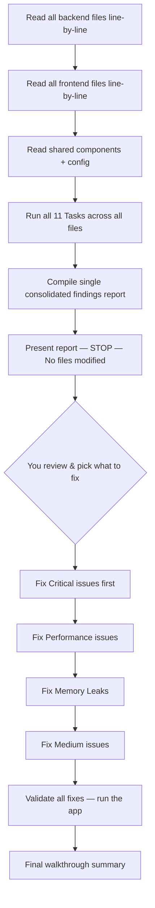

# Deep Codebase Review — AGS ERP Desktop (Final Plan)

> **Mode:** READ-ONLY investigation. No files will be modified during the audit.  
> **Focus:** Logic, handlers, queries, state management. JSX markup/styling is skipped.  
> **Fix Strategy:** Option A — Full findings report delivered first, you decide what to fix.

---

## Codebase Scope

| Layer | Files | Description |
|---|---|---|
| **Backend (Main Process)** | `ipcHandlers.js`, `main.cjs`, `db.js`, `preload.js` | DB schema, IPC bridge, scheduling, window management |
| **Backend Utilities** | `src/utils/voiceMatcher.js`, `src/utils/billMatcher.js`, `src/utils/billOcr.js` | Voice input matching, bill scanning, OCR |
| **Heavy-Data Frontend** | `Invoice.jsx`, `BuyerAccountDetail.jsx`, `SupplierAccountDetail.jsx`, `BuyerAccount.jsx`, `SupplierAccount.jsx`, `PriceList.jsx`, `ListQuickSales.jsx`, `CustomerOrder.jsx`, `SupplierOrder.jsx`, `NotificationsPage.jsx` | The 10 most complex/data-heavy pages |
| **Shared Components** | `SearchableDropdown.jsx`, `SelectDropdown.jsx`, `NavBar.jsx`, `Layout.jsx` | Components used across multiple pages |
| **Config** | `package.json`, `eslint.config.mjs`, `vite.config.mjs` | Build, lint, dependencies |

---

## Context

The app has grown significantly and now includes:
- Invoice status tracking with cascading recalculation
- Multi-payment history per invoice
- Voice input for product matching
- Bill scanning with OCR
- Notification systems scanning across multiple tables daily
- Marathi transliteration via external API

---

## 11 Audit Tasks

---

### Task 1 — Unbounded Query Audit

**Target:** Every SQL query in `ipcHandlers.js` and `db.js`

For each query:
- Does it have a `LIMIT` clause, or does it fetch the entire table?
- If it fetches "all customers" / "all products" / "all invoices" — is there a plausible scenario where this table grows to thousands of rows over years of use?
- Does the frontend paginate AFTER fetching everything (bad — wastes memory and IPC payload) or does the backend paginate via `LIMIT/OFFSET` (good)?

**Deliverable:** Table of every unbounded query, whether it's actually a problem given data growth, and recommended fix.

---

### Task 2 — N+1 Query Pattern Detection

**Target:** `ipcHandlers.js`, `main.cjs`

Specifically searching for:
- Any `for` loop or `.map()`/`.forEach()` that calls `db.prepare(...).get()` or `.all()` inside the loop, when it could be a single query with JOIN or IN
- The notification cleanup logic — does it batch or loop per-row?
- `recalculateInvoiceStatus()` — how many separate queries per call? Is it called in a loop anywhere (bulk payment, bill scanner, overdue refresh)?
- The overdue invoice scanner in `main.cjs` — same question

**Deliverable:** For each N+1 found: the exact loop, query count for N rows, and the single-query alternative.

---

### Task 3 — React Re-render Audit

**Target:** `BuyerAccountDetail.jsx`, `SupplierAccountDetail.jsx`, `PriceList.jsx`, `ListQuickSales.jsx`, `Invoice.jsx`

For each file:
- List every `useState` and `useEffect`
- Check each `useEffect` dependency array for recreated-every-render deps (inline objects, unmemoized arrays)
- Find derived values (running totals, filtered/sorted lists) computed in render body without `useMemo` on large datasets
- Check if editing one row re-renders the entire list
- Check if search/filter runs on every keystroke without debouncing

---

### Task 4 — Memory Leak Detection

**Target:** All audited files

Checking every instance of:
- `ipcRenderer.on()` / `window.api.onX()` — matching cleanup in `useEffect` return?
- `setInterval` / `setTimeout` — cleared on unmount?
- `addEventListener` on window/document — matching `removeEventListener`?

**Specific focus:**
- `NavBar.jsx` — notification count listener
- `SearchableDropdown.jsx` / `SelectDropdown.jsx` — click-outside handlers
- Voice input / OCR progress listeners
- Marathi batch transliteration progress listener in `Layout.jsx`

---

### Task 5 — Infinite Loop / Runaway State Risk

**Target:** Every `useEffect` across all audited frontend files

Checking for:
- Effect that updates state where that state is in its own dependency array
- Object/array literals in dependency arrays (recreated every render, causing infinite re-fire)
- Recursive functions without clear base cases in voice/OCR matching utilities

---

### Task 6 — Main Process Blocking Operations

**Target:** `main.cjs`, `ipcHandlers.js`

Checking for:
- Large synchronous loops over DB results
- Synchronous file operations (`fs.readFileSync`, `fs.writeFileSync`) on potentially large files (bill images, PDFs, OCR models)
- Daily notification scan, overdue scanner, QS cleanup — do these run synchronously on the main thread during startup, delaying the window?

---

### Task 7 — Critical Error Conditions

**Target:** All files — real-world edge cases

| Edge Case | What Could Break |
|---|---|
| Customer/supplier with ZERO maal or jama entries | Ledger page totals on empty arrays |
| Invoice with `grand_total = 0` | `recalculateInvoiceStatus` divide-by-zero or status mismatch |
| Deleting a product with MANY references vs ZERO | Cascade logic scaling |
| Bill scan producing ZERO matched items | StepMatch / StepPreview on empty items array |
| Rapid double-click on Save / Add Payment / Push | Duplicate submission without disabled-during-async guard |

---

### Task 8 — Security Surface Audit

**Target:** `preload.js`, `ipcHandlers.js`, `main.cjs`

Checking for:
- **Preload over-exposure:** Does `preload.js` expose a generic `invoke(channel, payload)` that lets the renderer call ANY IPC handler? Or is it restricted to a whitelist of channels?
- **IPC channel spoofing:** Could a compromised renderer call dangerous handlers (e.g., `db:drop`, `auth:bypass`) if channels aren't validated?
- **XSS vectors:** Any place where user-controlled strings (customer names, product names, remarks) are rendered as raw HTML via `dangerouslySetInnerHTML` or injected into PDF templates without escaping?
- **Sensitive data in logs:** Are passwords, tokens, or full customer details logged to console in error handlers?
- **File path traversal:** In bill scan / OCR file handling — can a crafted filename escape the intended directory?
- **Auth bypass:** Is the login/auth flow enforced on every IPC call, or could someone skip the login screen and directly invoke IPC handlers?

---

### Task 9 — Error Handling & Input Validation

**Target:** `ipcHandlers.js` (all handlers), frontend form submissions

Checking for:
- **Missing try-catch:** IPC handlers that can throw without being caught by the `wrap()` utility — e.g., handlers registered outside `wrap()`, or async handlers where `wrap()` doesn't await
- **Swallowed errors:** Catch blocks that log but don't return an error to the renderer, leaving the UI in a loading state forever
- **Type coercion bugs:** Numeric fields received as strings — `amount = "abc"` passed to `parseFloat()` producing `NaN` that gets stored in SQLite
- **Missing required field validation:** Handlers that destructure payload but don't check for `null`/`undefined` before using values in queries
- **Partial transaction failures:** Transactions where an error mid-way leaves data half-written (e.g., invoice header created but items insert fails — is it rolled back?)
- **Vague error messages:** `{ error: 'Something went wrong' }` vs actionable messages the user can understand

---

### Task 10 — Code Duplication Detection

**Target:** Primarily the mirrored Buyer/Supplier and Customer/Supplier pairs

Checking for:
- **Page-level duplication:** `BuyerAccountDetail.jsx` (60KB) vs `SupplierAccountDetail.jsx` (63KB) — how much is copy-pasted? Could they share a base component?
- **`BuyerAccount.jsx`** vs **`SupplierAccount.jsx`** — same question
- **`AddCustomerOrder.jsx`** vs **`AddSupplierOrder.jsx`** — same question
- **`CustomerOrder.jsx`** vs **`SupplierOrder.jsx`** — same question
- **Handler duplication in `ipcHandlers.js`:** Are the customer handlers and supplier handlers near-identical copies with just table names swapped?
- **PDF generators:** `generateInvoicePDF.js`, `generateOrderPDF.js`, `generateQuickSalePDF.js` — shared patterns that could be extracted into a base PDF builder?
- **Pagination/sort/search logic:** Is the same pagination pattern copy-pasted across 7+ list pages instead of being a shared hook?

**Deliverable:** Estimated duplication percentage and concrete extraction opportunities.

---

### Task 11 — Dead Code & Dependency Audit

**Target:** All source files + `package.json`

Checking for:
- **Unused imports:** React components or utilities imported but never used
- **Unreachable code:** Return statements before code, conditions that can never be true
- **Commented-out blocks:** Large blocks of old code left as comments
- **Unused IPC handlers:** Handlers registered in `ipcHandlers.js` that no frontend page ever calls
- **Hardcoded magic numbers:** Pagination defaults (25, 50, 100), timeout durations (1000, 5000), date offsets scattered across files instead of centralized constants
- **`npm audit`:** Known vulnerabilities in current dependencies
- **Unnecessary dependencies:** Packages in `package.json` that aren't actually imported anywhere
- **Outdated packages:** Major version bumps available for critical deps (Electron, React, better-sqlite3)

---

## Severity Classification

| Severity | Meaning | Example |
|---|---|---|
| 🔴 **Critical** | Crash, data corruption, security hole, complete freeze | SQL injection, infinite loop, unhandled null, auth bypass |
| 🟠 **Performance** | Works today, degrades as data grows | Unbounded fetch of 10K+ rows, N+1 in loop |
| 🟡 **Memory Leak** | Slow degradation over session lifetime | Uncleared listener, orphaned interval |
| 🔵 **Medium** | Code smell, minor bug, validation gap, duplication | Missing validation, stale closure, copy-paste |
| ⚪ **Info** | Architecture observation, DX improvement | Refactoring opportunity, dead code, outdated dep |

---

## Output Format

The final report will follow this structure:

```markdown
## 🔴 Critical Issues
| # | Task | Issue | File | Line(s) | Impact | Fix Complexity |

## 🟠 Performance Issues
| # | Task | Issue | File | Line(s) | Estimated Impact at Scale | Fix Complexity |

## 🟡 Memory Leak Risks
| # | Task | Listener/Timer | File | Line(s) | Cleanup Missing? |

## 🔵 Medium Issues
| # | Task | Issue | File | Line(s) | Description |

## ⚪ Info / Observations
| # | Task | Observation | File | Line(s) | Suggestion |

## 🟢 Things Already Handled Well
(Confirms what NOT to worry about)

## 📊 Summary
- Total critical issues: N
- Total performance issues: N
- Total memory leak risks: N
- Total medium issues: N
- Total info items: N
- Estimated highest-risk file: [name]
- Estimated most-duplicated pair: [files]
- Recommended fix order: [top 5 by impact]
```

Closing line:
> "Audit complete. No files were changed.  
> Found N critical, N performance, N memory leak, N medium issues.  
> Share this report and I'll tell you which to fix first and how."

---

## Execution Workflow



> [!IMPORTANT]
> **Single-pass audit.** I read every file, run all 11 tasks simultaneously, and deliver one consolidated report. You then tell me which findings to fix, and I execute in priority order.

---

## File Read Order

To maximize efficiency and cross-reference findings:

| Pass | Files | Reason |
|---|---|---|
| **1 — DB Schema** | `db.js` | Understand all tables, columns, indexes before checking queries |
| **2 — IPC Handlers** | `ipcHandlers.js` | All queries, validation, transactions — Tasks 1, 2, 6, 7, 8, 9 |
| **3 — Main Process** | `main.cjs` | Startup, scheduling, window management — Tasks 2, 4, 6, 8 |
| **4 — Preload** | `preload.js` | Security surface — Task 8 |
| **5 — Backend Utils** | `voiceMatcher.js`, `billMatcher.js`, `billOcr.js` | Task 5, 6, 7 |
| **6 — Heavy Pages** | All 10 module JSX files | Tasks 3, 4, 5, 7, 10 |
| **7 — Shared** | `SearchableDropdown`, `SelectDropdown`, `NavBar`, `Layout` | Tasks 4, 5 |
| **8 — Config** | `package.json`, `eslint.config.mjs`, `vite.config.mjs` | Task 11 |

---

Ready to begin on your approval.
