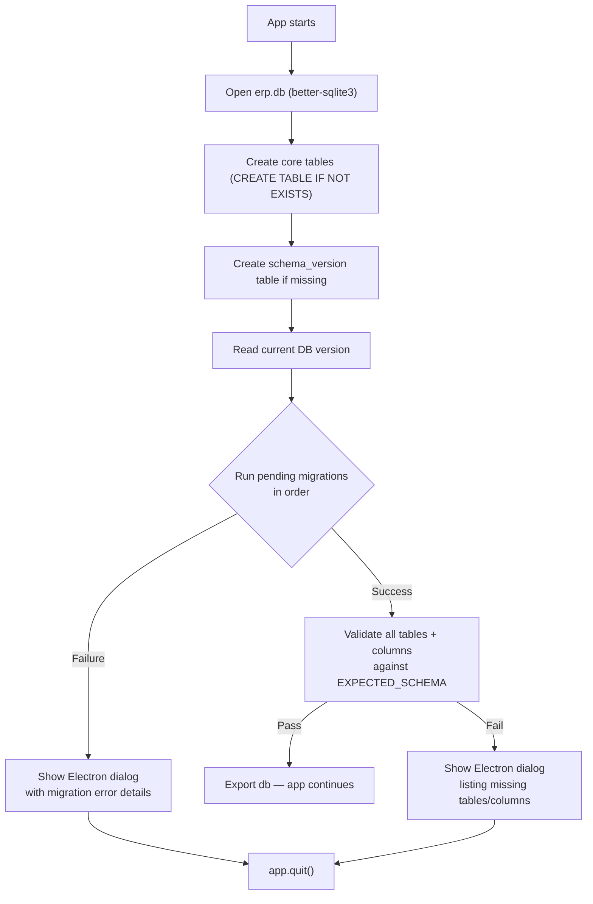

# AGS ERP — Database Migration & Schema Validation Guide

> **File:** `db.js`  
> **Last Updated:** June 2026  
> **Who is this for?** Any developer (or AI assistant) maintaining or upgrading this app.

---

## Why This Exists

AGS ERP is installed via NSIS (Windows `.exe`). When you install a **new version over an old one**, the app code is replaced but the **SQLite database in `%APPDATA%`** is preserved. This means:

- New columns added in code won't exist in the old database
- New tables won't be created (because `CREATE TABLE IF NOT EXISTS` only checks if the *table* exists, not if it has all the right columns)
- The app will crash deep inside an IPC handler with an unhelpful error

The migration system solves this by:

1. **Tracking the DB schema version** in a `schema_version` table
2. **Running pending migrations** in order on every app startup
3. **Validating the final schema** against what the code expects
4. **Showing a clear error dialog** if anything is wrong

---

## Architecture



---

## Key Components in `db.js`

### 1. `schema_version` Table

```sql
CREATE TABLE IF NOT EXISTS schema_version (
  id      INTEGER PRIMARY KEY CHECK (id = 1),
  version INTEGER NOT NULL DEFAULT 0
)
```

Single-row table. The `CHECK (id = 1)` constraint ensures only one row ever exists. The `version` column tracks which migrations have already been applied.

- `version = 0` → fresh DB, no migrations run yet
- `version = 1` → baseline migrations applied
- `version = N` → all migrations up to vN have been applied

### 2. `MIGRATIONS` Array

A JavaScript array at the top of `db.js`. Each entry is an object:

```js
{
  version: 1,                    // Must be sequential (1, 2, 3, ...)
  description: 'What this does', // Human-readable, logged to console
  up: (db) => {                  // The migration function
    // Use safeAddColumn() for ALTER TABLE operations
    // Use db.prepare().run() for anything else
  }
}
```

**Rules:**
- Versions must be **sequential integers** starting from 1
- Each migration must be **idempotent** — running it twice must not break anything
- Use `safeAddColumn()` for adding columns (it silently skips if column already exists)
- Never remove or edit an existing migration — only add new ones at the end

### 3. `safeAddColumn()` Helper

```js
function safeAddColumn(db, table, column, definition) {
  try {
    db.prepare(`SELECT ${column} FROM ${table} LIMIT 1`).get()
  } catch {
    db.prepare(`ALTER TABLE ${table} ADD COLUMN ${column} ${definition}`).run()
  }
}
```

This is the core utility for safe column additions. It:
- Tries to SELECT the column — if it exists, does nothing
- If the SELECT throws (column doesn't exist), runs ALTER TABLE to add it
- This is idempotent — safe to run multiple times

### 4. `EXPECTED_SCHEMA` Map

A plain JavaScript object mapping every table name to its expected column list:

```js
const EXPECTED_SCHEMA = {
  products: ['code', 'name', 'size', 'cost_price', 'selling_price', ...],
  customers: ['customer_id', 'name', 'address', 'mobile', ...],
  // ... every table in the app
}
```

This is the **source of truth** for what the DB must look like. After all migrations run, every table and column in this map is checked against the actual DB.

### 5. `validateSchema()` Function

```js
function validateSchema(db, expectedSchema) {
  const errors = []
  for (const [table, expectedCols] of Object.entries(expectedSchema)) {
    const actualCols = db.prepare(`PRAGMA table_info(${table})`).all().map(c => c.name)
    if (actualCols.length === 0) {
      errors.push(`Table "${table}" does not exist`)
      continue
    }
    for (const col of expectedCols) {
      if (!actualCols.includes(col)) {
        errors.push(`Column "${table}.${col}" is missing`)
      }
    }
  }
  return errors  // empty array = all good
}
```

### 6. Error Export

```js
module.exports = db
module.exports.dbError = dbError  // null if OK, string if error
```

`main.cjs` checks `db.dbError` after require. If it's non-null, a native OS dialog is shown and the app quits.

---

## How to Add a New Migration

### Step-by-step

**Step 1:** Add a new entry to the `MIGRATIONS` array in `db.js`:

```js
const MIGRATIONS = [
  // ... existing migrations ...

  {
    version: 2,  // ← next sequential number
    description: 'Add discount column to invoices',
    up: (db) => {
      safeAddColumn(db, 'invoices', 'discount', 'REAL DEFAULT 0.0')
    }
  },
]
```

**Step 2:** Update the `EXPECTED_SCHEMA` to include the new column:

```js
const EXPECTED_SCHEMA = {
  // ...
  invoices: ['invoice_id', ..., 'payment_due_days', 'discount'],  // ← added here
  // ...
}
```

**Step 3:** If you're adding a **new table**, also add the `CREATE TABLE IF NOT EXISTS` statement in the table creation section (before migrations) AND add the table to `EXPECTED_SCHEMA`.

**Step 4:** Test:
- Fresh install (delete `erp.db`) → should create everything
- Upgrade (keep old `erp.db`) → should add missing columns
- Re-run (same version) → should do nothing (idempotent)

That's it. Two changes: one in `MIGRATIONS`, one in `EXPECTED_SCHEMA`.

---

## Migration Types — Examples

### Adding a column

```js
{
  version: 3,
  description: 'Add GST number to customers',
  up: (db) => {
    safeAddColumn(db, 'customers', 'gst_number', 'TEXT DEFAULT NULL')
  }
}
```

### Adding multiple columns

```js
{
  version: 4,
  description: 'Add shipping fields to invoices',
  up: (db) => {
    safeAddColumn(db, 'invoices', 'shipping_address', 'TEXT DEFAULT NULL')
    safeAddColumn(db, 'invoices', 'shipping_date', 'TEXT DEFAULT NULL')
    safeAddColumn(db, 'invoices', 'tracking_number', 'TEXT DEFAULT NULL')
  }
}
```

### Adding a new table

```js
{
  version: 5,
  description: 'Add purchase returns table',
  up: (db) => {
    db.prepare(`
      CREATE TABLE IF NOT EXISTS purchase_returns (
        id          INTEGER PRIMARY KEY AUTOINCREMENT,
        supplier_id TEXT NOT NULL,
        return_date TEXT NOT NULL,
        amount      REAL NOT NULL,
        reason      TEXT,
        FOREIGN KEY(supplier_id) REFERENCES suppliers(supplier_id)
      )
    `).run()
  }
}
```

> Remember to also add the `CREATE TABLE IF NOT EXISTS` in the main table creation section and add it to `EXPECTED_SCHEMA`.

### Adding an index

```js
{
  version: 6,
  description: 'Add index on invoice_date for report queries',
  up: (db) => {
    db.prepare('CREATE INDEX IF NOT EXISTS idx_invoices_date_status ON invoices(invoice_date, status)').run()
  }
}
```

> Indexes don't need to be in `EXPECTED_SCHEMA` — only tables and columns are validated.

### Data migration (backfill)

```js
{
  version: 7,
  description: 'Backfill default GST rate for existing products',
  up: (db) => {
    safeAddColumn(db, 'products', 'gst_rate', 'REAL DEFAULT 18.0')
    db.prepare('UPDATE products SET gst_rate = 18.0 WHERE gst_rate IS NULL').run()
  }
}
```

---

## What the Error Dialog Looks Like

When the schema validation fails, the user sees a native Windows dialog:

```
┌─ AGS ERP — Database Error ─────────────────────────────┐
│                                                         │
│  Database schema validation failed:                     │
│                                                         │
│  Column "invoices.discount" is missing                  │
│  Column "customers.gst_number" is missing               │
│                                                         │
│  Current DB version: 1                                  │
│  Expected DB version: 3                                 │
│                                                         │
│  Please contact Vansh for an updated version.           │
│                                                         │
│                    [ OK ]                                │
└─────────────────────────────────────────────────────────┘
```

This gives you **exactly** what's wrong so you can fix it in the next build.

---

## Troubleshooting

### "The app won't open on my other laptop after update"

1. Check the error dialog — it will list exactly which columns/tables are missing
2. Make sure the `MIGRATIONS` array in `db.js` includes all needed ALTER TABLE changes
3. Rebuild and re-install

### "Migration vN failed: ..."

1. The migration function threw an error
2. The transaction was rolled back — the DB is still at the previous version
3. Check the migration's `up()` function for bugs
4. Fix the migration code, rebuild, and re-install

### "I need to test on a fresh database"

1. Close the app
2. Delete `%APPDATA%\ags-erp\erp.db` (the exact path varies — check `app.getPath('userData')`)
3. Restart the app — a fresh DB will be created with all tables and migrations

### "I need to check the current DB version"

Open the app's developer tools (Ctrl+Shift+I) and run:

```js
await window.api.invoke('admin:getSchemaVersion')
```

Or check the DB file directly with any SQLite viewer:

```sql
SELECT version FROM schema_version WHERE id = 1
```

---

## File Reference

| File | Role |
|---|---|
| `db.js` | Schema creation, migration runner, validation, exports `db` + `dbError` |
| `main.cjs` | Checks `db.dbError` on startup, shows error dialog if non-null |
| `docs/migrations.md` | This file — reference guide |

---

## Rules Summary

1. **Never edit an existing migration** — only add new ones at the end
2. **Always update `EXPECTED_SCHEMA`** when adding columns or tables
3. **Always use `safeAddColumn()`** for ALTER TABLE — never raw ALTER
4. **Versions must be sequential** — 1, 2, 3, ... (no gaps, no decimals)
5. **Each migration must be idempotent** — safe to run multiple times
6. **Test both fresh install AND upgrade** before shipping a new version
